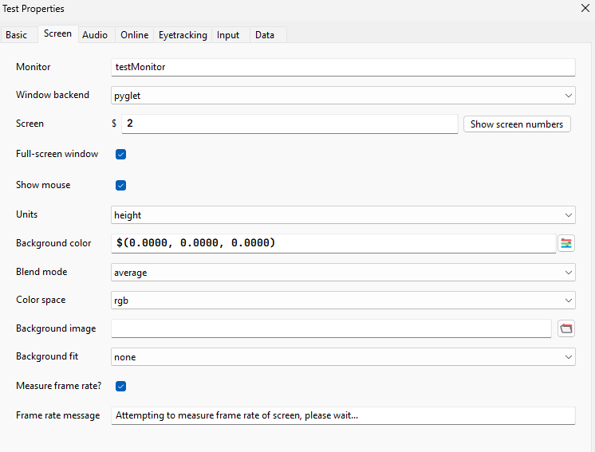
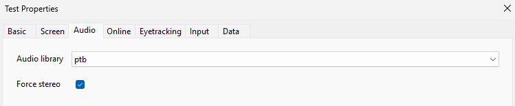
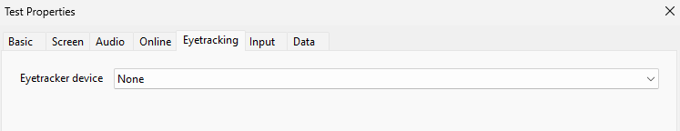
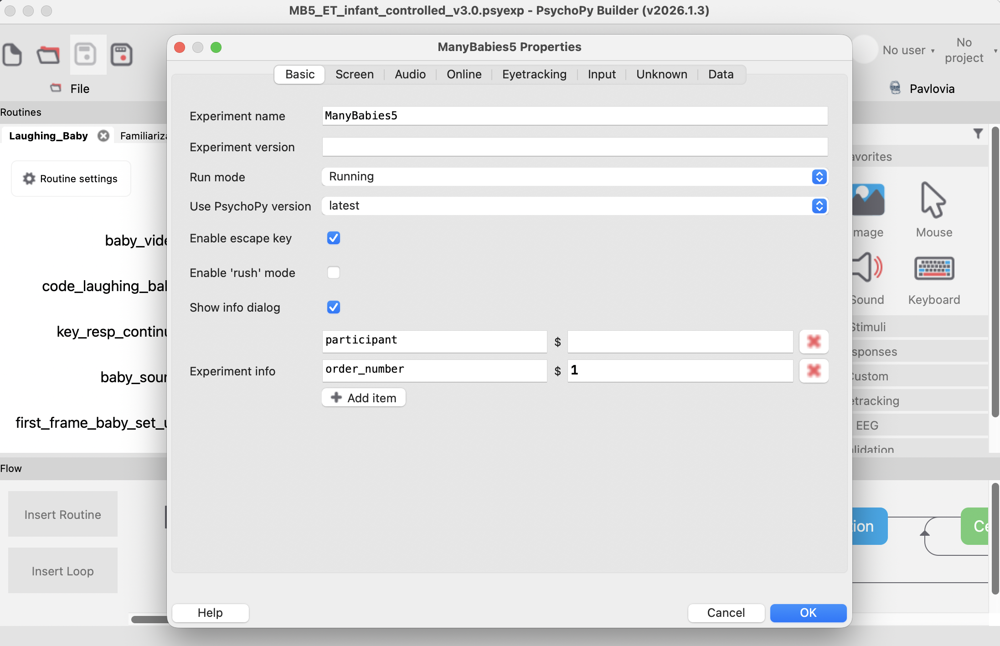
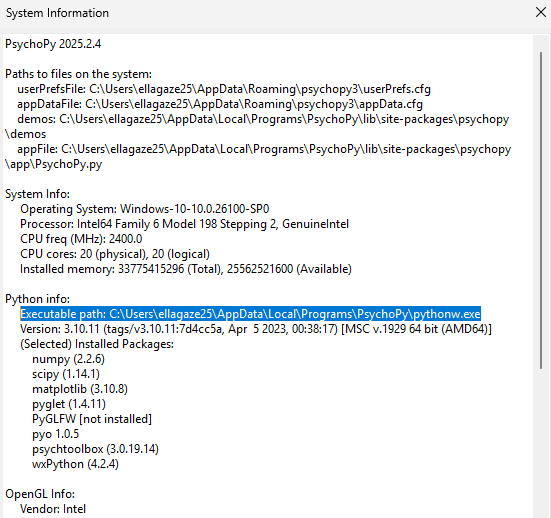

# ManyBabies 5 — PsychoPy and Tobii Eye Tracking Set Up Instructions

*2nd draft version — please message <insert name / contact> with any feedback, issues, or problems.*

## Required Equipment / Software

- Any Tobii eye tracker
  - Check compatibility: [Tobii Pro SDK Eye Tracker Compatibility](https://developer.tobiipro.com/tobiiprosdk/eyetrackercompatibility.html)
  - If your device is on the **"Discontinued eye trackers"** list, you will need to use the experiment file named `MB5_ET_infant_controlled_v3.0_old_device.psyexp`
- [Tobii Eye Tracker Manager](https://connect.tobii.com/s/etm-downloads-language=en_US)
- PsychoPy (preferably v2025.2.4 or newer)
- for discontinued eye trackers try: https://github.com/psychopy/psychopy/releases/tag/2023.2.3

## Necessary Python Packages

- `tobii-research` — install from the Plugin Manager in PsychoPy, or `pip install`, making sure you install to the correct Python path (v1.10.1 for discontinued eye trackers)
- `ffmpeg-python` — installed the same way as `tobii-research` (on Windows this should be installed by default)

## Stimuli, Assets, and PsychoPy Script

Download all files from the link below and keep them in one folder on the machine you are using to run the experiment.

<!-- TODO: Check this is still needed! 📁 [MB5 PsychoPy Builder Set Up — Google Drive](https://drive.google.com/drive/folders/   1MxtvPNrxcWdSX4aonC66vzK41BqXZl8a) -->

### Directory Structure
---> update to final design!!!
```
MB5_PsychoPy_Builder_SetUp
├── data/                     # eye tracking data will be stored here
├── stimuli/
        └── movies # video files for experiment
        └── images # all stimuli images
        └── audio # audio files corresponding to movies            
├── trials/       # store the lists assigned to your lab here
├── set_up_imgs  # ignore
└── MB5_infant_controlled.psyexp   # the PsychoPy file — open this in Builder view to run the experiment
```

## Lab Set Up

Below are screenshots to help you set everything up in your lab.

**Screen Units:** set to `height`, as shown below:



**Audio Library:** set to `ptb` or `pygame`, as shown below:



**Eyetracking:** set to `none`.
> Note: your eye tracker will be controlled via `tobii-research` and Python code components, not via PsychoPy's built-in eye tracking setting.



## Running the Experiment

1. Open the `.psyexp` file in the PsychoPy Builder view.
2. Make sure you have selected a working default speaker and turned up the volume.
3. Click the green run button.
4. In the pop-up window, enter the participant identification following your lab's SOP. In the box for order_number, enter the trial number (number in name of the CSV file) for this participant. Your lab will receive a set of CSV files with randomization information — for each participant, select the corresponding file here.



The experiment should now start. There are no participant instructions, as this is an infant-controlled design.

- If the infant does not look at the screen during familiarization, the trial will continue after a fixed duration.

During the **laughing baby** video, the experimenter can use the following controls:

| Key | Action |
|-----|--------|
| <kbd>Space</kbd> | Continue to the fixation screen and familiarization phase. |
| <kbd>P</kbd> | Pause the experiment and display the bunny image. |
| <kbd>S</kbd> | Resume the experiment, returning from the bunny image to the laughing baby video. |


Let the trial run through to completion. At the end, you will see the bunnies image for a brief moment. Afterward, check the `data` folder for this participant's data — there should be an Excel file containing time series eye tracking data, with the participant identification information in the file name.

## Finding Your Python Path

If you do not know which Python path and version your PsychoPy installation is using, go to **System Information** within PsychoPy and check the Python information, as shown below:



---

Thank you for helping test this set up! We very much appreciate your support of this Many Babies project.
